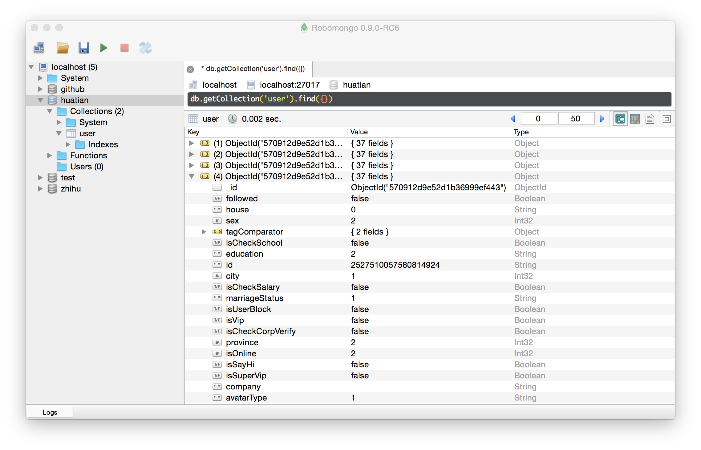
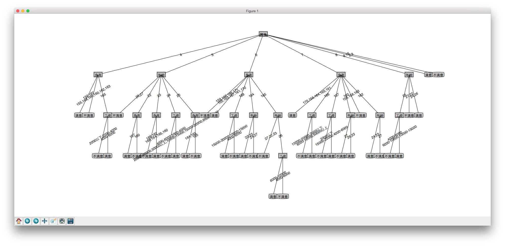

# huatian-funny

用决策树科学地分析自己的择偶观

## 爬取数据

修改huatian/spider.py中的用户名和密码，运行文件spider.py，爬取花田网站上上海地区年龄22-27的女性用户，数据存储在mongodb中，结果如下：

## 数据标注

由于没有好的工具根据照片评估项目，只能主观打分，mark.py是为了方便快捷整理数据的一个桌面程序，运行结果如下：

## 生成决策树

运行train.py, 生成结果如下：

